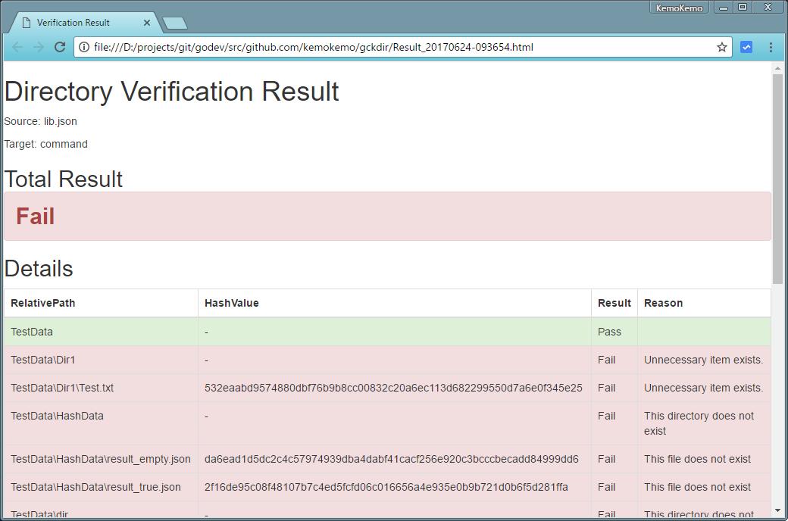
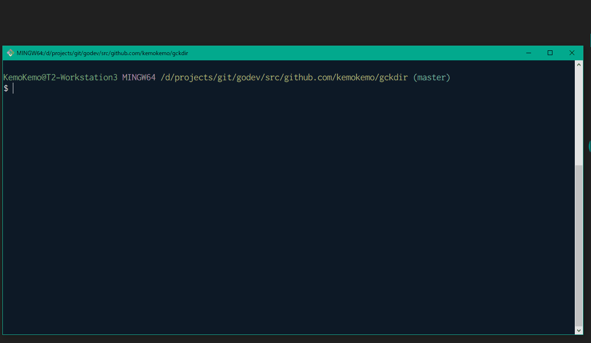

[](https://travis-ci.org/KemoKemo/gckdir) [](https://coveralls.io/github/KemoKemo/gckdir?branch=master) [](https://goreportcard.com/report/github.com/KemoKemo/gckdir) [](https://github.com/goreleaser)

# gckdir

This is go-check-directory tool.

## Description

This tool can generate a hash list of specified directory in the json format.  
With the hash list, you can verify the target directory's structure and each hash value
of files.

## Usage

### Generate

```bash
$ gckdir generate path/to/source_directory hash_name.json
```

For more details, please see `gckdir generate --help`.

### Verify

```bash
$ gckdir verify hash_name.json path/to/target_directory
```
or
```bash
$ gckdir verify path/to/source_directory path/to/target_directory
```

For more details, please see `gckdir verify --help`.

#### Create a result report

```bash
$ gckdir verify --report hash_name.json path/to/target_directory
```

You can create a verification result report with `--report` option.



#### Create and open immediately a result report

```bash
$ gckdir verify --open hash_name.json path/to/target_directory
```

If you want to check the result immediately on the browser, please use the `--open` option. This option includes the `--report` option.



## ExitCode

ExitCode returns with 0 if all processing is successful.  
When a problem occurs, an integer of 1 or more is returned as ExitCode.  
Even when the comparison result is Fail, an integer of 1 or more is returned as ExitCode.

## Install

To install, use `go get`:

```bash
$ go get -d github.com/KemoKemo/gckdir
```

## Contribution

1. Fork ([https://github.com/KemoKemo/gckdir/fork](https://github.com/KemoKemo/gckdir/fork))
1. Create a feature branch
1. Commit your changes
1. Rebase your local changes against the master branch
1. Run test suite with the `go test ./...` command and confirm that it passes
1. Run `gofmt -s`
1. Create a new Pull Request

## Author

[KemoKemo](https://github.com/KemoKemo)

## License

MIT

## Special Thanks

This application uses the following excellent projects.

* [github.com/urfave/cli](https://github.com/urfave/cli) - [MIT License](https://github.com/urfave/cli/blob/master/LICENSE)
* [github.com/ahmetb/go-linq](https://github.com/ahmetb/go-linq) - [Apache License 2.0](https://github.com/ahmetb/go-linq/blob/master/LICENSE)
* [github.com/skratchdot/open-golang](https://github.com/skratchdot/open-golang) - [MIT License](https://github.com/skratchdot/open-golang/blob/master/LICENSE-MIT)
